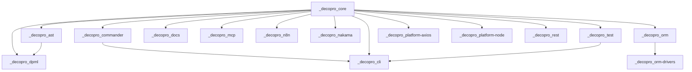

# decopro

**Version**: 1.0.0

# Quick Start Guide

## Installation

```bash
npm install @decopro/ast @decopro/cli @decopro/commander @decopro/core @decopro/docs @decopro/dpml @decopro/mcp @decopro/n8n @decopro/nakama @decopro/orm @decopro/orm-drivers @decopro/platform-axios @decopro/platform-node @decopro/rest @decopro/test
```

## Basic Usage

```typescript
import { bootstrap } from "@decopro/core";

// Initialize your application
const app = await bootstrap([
  // Your modules here
]);
```

## @decopro/cli

// Test: should create instance with injector
expect(cliAppInit).toBeInstanceOf(CliAppInit);


# Project Architecture

This project follows a modular architecture with the following packages:

## @decopro/core

Core dependency injection and module system for decopro framework

## Architecture Overview

This package contains the following components:

- **class**: 5 file(s)
- **test**: 4 file(s)
- **interface**: 4 file(s)
- **types**: 1 file(s)
- **module**: 1 file(s)

### Key Dependencies

- **tsyringe**: used in 8 file(s)
- **tsyringe/dist/typings/types**: used in 1 file(s)
- **path**: used in 1 file(s)
- **tsup**: used in 1 file(s)


### Dependencies

- reflect-metadata
- tslib
- tsyringe

## @decopro/ast

## Architecture Overview

This package contains the following components:

- **interface**: 1 file(s)
- **module**: 1 file(s)

### Key Dependencies

- **@decopro/core**: used in 1 file(s)
- **tsup**: used in 1 file(s)


### Dependencies

- @decopro/core
- zod

## @decopro/commander

## Architecture Overview

This package contains the following components:

- **interface**: 1 file(s)
- **module**: 1 file(s)

### Key Dependencies

- **@decopro/core**: used in 1 file(s)
- **zod**: used in 1 file(s)
- **tsup**: used in 1 file(s)


### Dependencies

- @decopro/core
- zod

## @decopro/test

## Architecture Overview

This package contains the following components:

- **interface**: 1 file(s)
- **module**: 1 file(s)

### Key Dependencies

- **@decopro/core**: used in 1 file(s)
- **tsup**: used in 1 file(s)


### Dependencies

- @decopro/core
- zod

## @decopro/cli

## Architecture Overview

This package contains the following components:

- **test**: 1 file(s)
- **module**: 7 file(s)
- **interface**: 2 file(s)
- **class**: 3 file(s)

### Key Dependencies

- **@decopro/core**: used in 7 file(s)
- **@modelcontextprotocol/sdk/server/mcp.js**: used in 2 file(s)
- **@decopro/mcp**: used in 2 file(s)
- **commander**: used in 1 file(s)
- **@decopro/commander**: used in 1 file(s)
- **zod**: used in 1 file(s)
- **os**: used in 1 file(s)
- **dotenv**: used in 1 file(s)
- **path**: used in 1 file(s)
- **fs-extra**: used in 1 file(s)


### Dependencies

- @decopro/commander
- @decopro/core
- @decopro/test
- @modelcontextprotocol/sdk
- @types/express
- @types/fs-extra
- commander
- dotenv
- express
- fs-extra
- glob
- reflect-metadata
- tsx
- typescript
- zod

## @decopro/docs

Documentation generator for Decopro framework - optimized for AI/LLM consumption

## Architecture Overview

This package contains the following components:

- **interface**: 1 file(s)
- **entity**: 1 file(s)
- **module**: 1 file(s)

### Key Dependencies

- **fs**: used in 2 file(s)
- **path**: used in 2 file(s)
- **typescript**: used in 1 file(s)
- **crypto**: used in 1 file(s)
- **${corePackage.package_name}**: used in 1 file(s)
- **tsup**: used in 1 file(s)


### Dependencies

- @decopro/core
- typescript
- zod

## @decopro/dpml

## Architecture Overview

This package contains the following components:

- **interface**: 2 file(s)
- **module**: 4 file(s)
- **class**: 2 file(s)

### Key Dependencies

- **@decopro/ast**: used in 2 file(s)
- **@decopro/core**: used in 2 file(s)
- **tsup**: used in 1 file(s)


### Dependencies

- @decopro/core
- @decopro/ast
- zod

## @decopro/mcp

## Architecture Overview

This package contains the following components:

- **class**: 1 file(s)
- **module**: 7 file(s)
- **interface**: 1 file(s)

### Key Dependencies

- **@decopro/core**: used in 7 file(s)
- **@modelcontextprotocol/sdk/types**: used in 2 file(s)
- **zod**: used in 1 file(s)
- **@modelcontextprotocol/sdk/server/mcp.js**: used in 1 file(s)
- **tsup**: used in 1 file(s)


### Dependencies

- @decopro/core
- @modelcontextprotocol/sdk
- zod

## @decopro/n8n

## Architecture Overview

This package contains the following components:

- **module**: 2 file(s)

### Key Dependencies

- **tsup**: used in 1 file(s)


### Dependencies

- @decopro/core
- zod

## @decopro/nakama

## Architecture Overview

This package contains the following components:

- **api**: 1 file(s)
- **interface**: 5 file(s)
- **module**: 3 file(s)
- **types**: 1 file(s)
- **utility**: 1 file(s)

### Key Dependencies

- **js-base64**: used in 5 file(s)
- **@decopro/core**: used in 3 file(s)
- **base64-arraybuffer**: used in 1 file(s)
- **tsup**: used in 1 file(s)


### Dependencies

- @decopro/core
- base64-arraybuffer
- js-base64
- whatwg-fetch
- zod

## @decopro/orm

## Architecture Overview

This package contains the following components:

- **test**: 1 file(s)
- **entity**: 1 file(s)
- **module**: 2 file(s)

### Key Dependencies

- **@decopro/core**: used in 1 file(s)
- **zod**: used in 1 file(s)
- **tsup**: used in 1 file(s)


### Dependencies

- @decopro/core
- zod

## @decopro/orm-drivers

Database drivers for @decopro/orm

## Architecture Overview

This package contains the following components:

- **test**: 1 file(s)
- **orm**: 2 file(s)
- **module**: 2 file(s)
- **class**: 2 file(s)
- **interface**: 2 file(s)
- **utility**: 1 file(s)

### Key Dependencies

- **@decopro/core**: used in 2 file(s)
- **mysql2**: used in 1 file(s)
- **@decopro/orm**: used in 1 file(s)
- **sqlite3**: used in 1 file(s)
- **tsup**: used in 1 file(s)


### Dependencies

- @decopro/orm
- reflect-metadata

## @decopro/platform-axios

## Architecture Overview

This package contains the following components:

- **class**: 1 file(s)
- **module**: 1 file(s)

### Key Dependencies

- **@decopro/core**: used in 1 file(s)
- **tsup**: used in 1 file(s)


### Dependencies

- @decopro/core
- zod

## @decopro/platform-node

## Architecture Overview

This package contains the following components:

- **class**: 1 file(s)
- **module**: 1 file(s)

### Key Dependencies

- **@decopro/core**: used in 1 file(s)
- **tsup**: used in 1 file(s)


### Dependencies

- @microsoft/api-extractor
- @decopro/core
- tslib
- zod

## @decopro/rest

## Architecture Overview

This package contains the following components:

- **test**: 1 file(s)
- **controller**: 1 file(s)
- **module**: 1 file(s)

### Key Dependencies

- **@decopro/core**: used in 1 file(s)
- **zod**: used in 1 file(s)
- **tsup**: used in 1 file(s)


### Dependencies

- @decopro/core
- zod

## Dependency Graph




# API Overview

## @decopro/ast

### Main Exports

- `AstOptions`
- `AST_TOKEN`
- `Ast`
- `Visitor`

### Interface

- src/index.ts

### Module

- tsup.config.ts

## @decopro/cli

### Test

- src/__tests__/cliAppInit.test.ts

### Module

- src/agents/index.ts
- src/index.ts
- src/mcpServerFactory.ts
- src/prompts/index.ts
- src/services/index.ts
- ... and 2 more

### Interface

- src/bin.ts
- src/cliAppInit.ts

### Class

- src/mcpAppInit.ts
- src/prompts/readPrompt.ts
- src/services/env.service.ts

## @decopro/commander

### Main Exports

- `OptionOptions`
- `OPTION_TOKEN`
- `Option`
- `ActionOptions`
- `ACTION_TOKEN`
- `Action`
- `ArgumentOptions`
- `ARGUMENT_TOKEN`
- `Argument`
- `CommanderOptions`
- `COMMANDER_TOKEN`
- `Commander`

### Interface

- src/index.ts

### Module

- tsup.config.ts

## @decopro/core

Core dependency injection and module system for decopro framework

### Main Exports

- `CoreModule`
- `BootstrapOptions`
- `container`
- `registry`
- `injectable`
- `inject`
- `singleton`
- `scoped`
- `Lifecycle`
- `instanceCachingFactory`
- `instancePerContainerCachingFactory`
- `InjectionToken`
- `Injector`

### Class

- src/DirectedGraph.ts
- src/LinkedList.ts
- src/UndirectedGraph.ts
- src/error.ts
- src/injector.ts

### Test

- src/__tests__/bootstrap-deps.test.ts
- src/__tests__/decorator-advanced.test.ts
- src/__tests__/injector.test.ts
- src/__tests__/setup.ts

### Interface

- src/decorator.ts
- src/index.ts
- src/input.ts
- src/tokens.ts

### Types

- src/types.ts

### Module

- tsup.config.ts

## @decopro/docs

Documentation generator for Decopro framework - optimized for AI/LLM consumption

### Main Exports

- `Knowledge`
- `PackageDocumentation`
- `ProjectDocumentation`
- `generateTSKnowledges`
- `generatePackageDocumentation`
- `generateProjectDocumentation`

### Interface

- src/cli.ts

### Entity

- src/index.ts

### Module

- tsup.config.ts

## @decopro/dpml

### Interface

- src/ast.ts
- src/tokenizer.ts

### Module

- src/index.ts
- src/main.ts
- src/parsePrompt.ts
- tsup.config.ts

### Class

- src/parser.ts
- src/run.ts

## @decopro/mcp

### Class

- src/McpOutputer.ts

### Module

- src/askAgent.ts
- src/callTool.ts
- src/getPrompt.ts
- src/getResource.ts
- src/index.ts
- ... and 2 more

### Interface

- src/decorator.ts

## @decopro/n8n

### Module

- src/index.ts
- tsup.config.ts

## @decopro/nakama

### Main Exports

- `ChannelMessage`

### Api

- src/api.gen.ts

### Interface

- src/client.ts
- src/rpc.ts
- src/session.ts
- src/socket.ts
- src/web_socket_adapter.ts

### Module

- src/index.ts
- src/tokens.ts
- tsup.config.ts

### Types

- src/types.ts

### Utility

- src/utils.ts

## @decopro/orm

### Test

- src/__tests__/decorator.test.ts

### Entity

- src/decorator.ts

### Module

- src/index.ts
- tsup.config.ts

## @decopro/orm-drivers

Database drivers for @decopro/orm

### Main Exports

- `registerAllDrivers`
- `registerSQLiteDriver`
- `registerMySQLDriver`
- `registerPostgreSQLDriver`
- `SQLiteDatabaseManager`
- `MySQLDatabaseManager`
- `isDriverAvailable`
- `getAvailableDrivers`

### Test

- src/__tests__/setup.ts

### Orm

- src/database.ts
- src/orm-manager.ts

### Module

- src/index.ts
- tsup.config.ts

### Class

- src/mysql.ts
- src/sqlite.ts

### Interface

- src/query-builder.ts
- src/repository.ts

### Utility

- src/test-utils.ts

## @decopro/platform-axios

### Main Exports

- `PlatformAxios`

### Class

- src/index.ts

### Module

- tsup.config.ts

## @decopro/platform-node

### Main Exports

- `PlatformNode`

### Class

- src/index.ts

### Module

- tsup.config.ts

## @decopro/rest

### Main Exports

- `BodyOptions`
- `BODY_TOKEN`
- `Body`
- `BODY`
- `QueryOptions`
- `QUERY_TOKEN`
- `Query`
- `QUERY`
- `ParamOptions`
- `PARAM_TOKEN`
- `Param`
- `PARAM`
- `HeaderOptions`
- `HEADER_TOKEN`
- `Header`
- `HEADER`
- `ControllerOptions`
- `CONTROLLER_TOKEN`
- `UserController`
- `Controller`
- `HttpRouteOptions`
- `GetOptions`
- `GET_TOKEN`
- `Get`
- `PostOptions`
- `POST_TOKEN`
- `Post`
- `PutOptions`
- `PUT_TOKEN`
- `Put`
- `DeleteOptions`
- `DELETE_TOKEN`
- `Delete`
- `SseOptions`
- `SSE_TOKEN`
- `Sse`
- `PatchOptions`
- `PATCH_TOKEN`
- `Patch`
- `HeadOptions`
- `HEAD_TOKEN`
- `Head`
- `OptionsOptions`
- `OPTIONS_TOKEN`
- `Options`
- `HttpMethod`
- `HttpStatus`
- `HttpStatusCode`
- `HTTP_METHOD_TOKENS`
- `PARAMETER_TOKENS`
- `isHttpMethodToken`
- `isParameterToken`
- `getHttpMethodToken`

### Test

- src/__tests__/decorators.test.ts

### Controller

- src/index.ts

### Module

- tsup.config.ts

## @decopro/test

### Main Exports

- `TestOptions`
- `TEST_TOKEN`
- `Test`

### Interface

- src/index.ts

### Module

- tsup.config.ts

